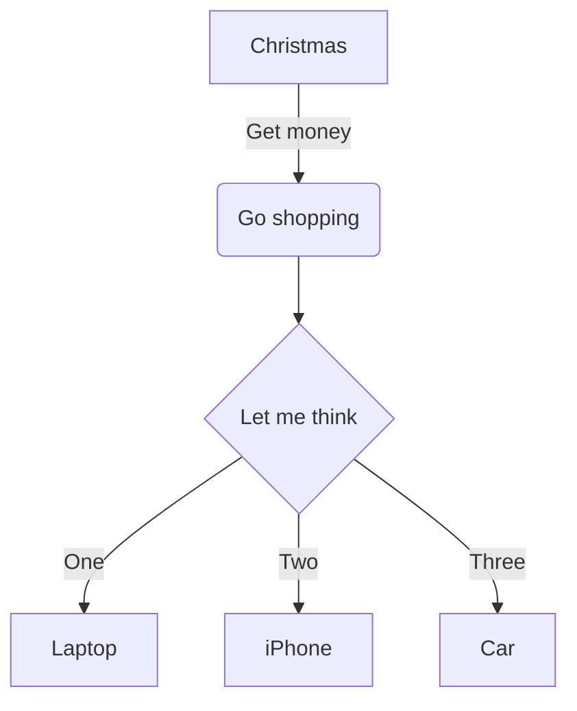

# Grafmaid — Mermaid.js Diagram Panel for Grafana

> [繁體中文版](README.zh-TW.md)

## Overview

Grafmaid is a Grafana panel plugin that integrates the [Mermaid.js](https://github.com/mermaid-js/mermaid) diagram engine into Grafana Dashboards, allowing users to write Mermaid syntax directly in panels to render various diagrams and dynamically control diagram content through Grafana Dashboard Variables and Data Queries.

### Core Design Principles

1. **Text-driven visualization** — Users describe diagrams using plain-text Mermaid syntax, no drag-and-drop editor needed
2. **Deep Grafana ecosystem integration** — Supports Dashboard Variables, Data Queries, Field Config (Units / Thresholds / Value Mappings), theme switching, and responsive scaling
3. **Security first** — `securityLevel: 'strict'` prevents XSS, automatic special character escaping

---

## Architecture

```
src/
├── components/
│   └── GrafmaidPanel.tsx          # Main panel component, lifecycle & rendering
├── utils/
│   ├── dataFrameExpander.ts       # Data Frame query result expansion (data blocks / single value / labels)
│   └── mermaidVariables.ts        # Dashboard Variables processing utilities
├── module.ts                      # Plugin entry point, panel options & Field Config definition
├── types.ts                       # TypeScript type definitions
└── plugin.json                    # Plugin metadata
tests/
├── unit/
│   ├── components/
│   │   └── GrafmaidPanel.test.tsx # Component unit tests
│   └── utils/
│       ├── dataFrameExpander.test.ts  # Data Frame expansion unit tests
│       └── mermaidVariables.test.ts   # Variable processing unit tests
└── panel.spec.ts                  # E2E tests (Playwright + @grafana/plugin-e2e)
```

### Rendering Pipeline

```
User inputs Mermaid Content
        │
        ▼
┌─ expandDataBlocks() ──┐
│  Expand Data Frame     │  ← Query results (data.series)
│  {{#each data}} iter   │  ← Multi-row expansion
│  ${__data.*} single/   │  ← Direct reference
│  label                 │
└────────────────────────┘
        │
        ▼
┌─ expandEachBlocks() ──┐
│  Expand {{#each}}      │  ← Multi-value Dashboard Variables
│  blocks                │
└────────────────────────┘
        │
        ▼
┌─ replaceVariables() ──┐
│  Substitute $var /     │  ← Grafana Dashboard Variables
│  ${var}                │
│  + mermaidSafeFormat   │  ← Optional: special char escaping
└────────────────────────┘
        │
        ▼
┌─ detectUnresolvedVariables() ─┐
│  Detect undefined variable    │  → Alert severity="warning"
│  references                   │
└───────────────────────────────┘
        │
        ▼
┌─ mermaid.parse() ─────┐
│  Syntax pre-validation │  → Precise error messages on failure
└────────────────────────┘
        │
        ▼
┌─ mermaid.render() ────┐
│  Render SVG diagram    │  → Embed in panel + responsive scaling
└────────────────────────┘
```

---

## Features

### 1. Basic Diagram Rendering

Enter any Mermaid syntax in the **Mermaid Content** panel option to render:



**Supported diagram types** (all Mermaid.js types):

| Type | Syntax Keyword | Description |
|------|---------------|-------------|
| Flowchart | `graph`, `flowchart` | Flow chart |
| Sequence Diagram | `sequenceDiagram` | Sequence diagram |
| Class Diagram | `classDiagram` | Class diagram |
| State Diagram | `stateDiagram-v2` | State diagram |
| ER Diagram | `erDiagram` | Entity-relationship diagram |
| Gantt Chart | `gantt` | Gantt chart |
| Pie Chart | `pie` | Pie chart |
| Mindmap | `mindmap` | Mind map |
| Timeline | `timeline` | Timeline |
| Git Graph | `gitGraph` | Git branch graph |
| C4 Diagram | `C4Component` | C4 architecture diagram |
| Quadrant Chart | `quadrantChart` | Quadrant chart |
| Kanban | `kanban` | Kanban board |
| Architecture | `architecture-beta` | Architecture diagram |
| Packet | `packet` | Packet diagram |
| Radar | `radar-beta` | Radar chart |

#### Screenshots


### 2. Dashboard Variables Substitution

Supports Grafana [Dashboard Variables](https://grafana.com/docs/grafana/latest/dashboards/variables/). Use `$varName` or `${varName}` syntax to reference variables in Mermaid Content.

#### Single-value Variables

```
# Dashboard Variable: env = "Production"

graph TD
    A[Service] --> B[$env]
```

`$env` is replaced with `Production` in the rendered output.

#### Format Specifiers

Works with Grafana [Variable format](https://grafana.com/docs/grafana/latest/dashboards/variables/variable-syntax/#advanced-variable-format-options) syntax:

- `${var:text}` — Text format
- `${var:csv}` — Comma-separated
- `${var:pipe}` — Pipe-separated

#### Screenshot


### 3. Multi-value Variable Expansion (`{{#each}}`)

When a Dashboard Variable is set to **Multi-value**, a simple `$var` substitution produces a merged string like `A, B, C`, which cannot be used directly in Mermaid node or edge definitions.

**Solution**: Use `{{#each varName}}...{{/each}}` template syntax to expand each value of a multi-value variable into separate Mermaid definitions.

#### Syntax

```
{{#each varName}}
    ... {{value}} ... {{index}} ...
{{/each}}
```

| Placeholder | Description |
|-------------|-------------|
| `{{value}}` | Current iteration value |
| `{{index}}` | Current iteration index (0-based) |

#### Example: Dynamic Topology

Assume Dashboard Variable `targets` is Multi-value with selected values `DB`, `Cache`, `Queue`:

**Input**:

```
graph TD
    Service[Web Service]
{{#each targets}}
    target_{{index}}[{{value}}]
    Service --> target_{{index}}
{{/each}}
```

**Expanded**:

```
graph TD
    Service[Web Service]
    target_0[DB]
    Service --> target_0
    target_1[Cache]
    Service --> target_1
    target_2[Queue]
    Service --> target_2
```

#### Example: Mixing Regular Variables with `{{#each}}`

```
graph TD
    $source[Source: $env]
{{#each destinations}}
    dest_{{index}}[{{value}}]
    $source --> dest_{{index}}
{{/each}}
```

In this example, `$source` and `$env` are regular single-value variables, while `destinations` is a multi-value variable. The `{{#each}}` block expands first, then `replaceVariables` substitutes `$source` and `$env`.

### 4. Data Queries Integration

The panel supports Grafana Data Source queries, enabling Mermaid diagrams to update dynamically based on live data. With `useFieldConfig()` enabled, Standard Options (Units, Thresholds, Value Mappings, Color scheme, etc.) are all configurable in the panel editor.

#### Standard Options Defaults

| Option | Default |
|--------|---------|
| Color scheme | From thresholds (by value) |
| Thresholds | Base: green, 80: red |

#### Syntax Overview

##### Shorthand syntax (auto-selects first non-Time value field)

```
${__data.CPU_A}              — Raw value (series by refId)
${__data.CPU_A:display}      — Formatted value (applies unit, decimals, value mapping)
${__data.CPU_A:color}        — Color (controlled by Color scheme, defaults to thresholds)
```

##### Full syntax (specify field name)

```
${__data.fields.Value}                   — Value field of series[0]
${__data.CPU_A.fields.Value:display}     — Specific series + field + formatting
${__data.fields["Field Name"]:display}   — Bracket notation (field names with spaces)
${__data.fields[0]}                      — By field index
```

##### Label Access

```
${__data.CPU_A.labels.http_status}   — Label from the value field
${__data.labels.server}              — Label from series[0]
```

##### Iteration Mode (multi-row expansion)

```
{{#each data}}             — Iterate over every row of series[0]
{{#each data.1}}           — Iterate over series[1]
{{#each data.CPU_A}}       — By refId or series name
```

Inside iteration blocks, use `${__index}` (row index) and `${__rowCount}` (total rows).

#### Series Resolution Priority

The `CPU_A` in `${__data.CPU_A.fields.Value}` is matched in the following order:

1. **refId** — The query reference ID (e.g., A, B, or custom name CPU_A)
2. **series name** — The DataFrame's name property
3. If no match is found, the placeholder is left as-is

#### Example: Single-value Mode

Query `CPU_A` returns CPU usage, with Thresholds (0: green, 80: red):

```
graph LR
    A["${__data.CPU_A.labels.server}"] --> B["CPU: ${__data.CPU_A:display}"]
    style B fill:${__data.CPU_A:color},color:#fff
```

Expanded result (assuming last row CPU = 92%, label server = "Apache HTTP Server"):

```
graph LR
    A["Apache HTTP Server"] --> B["CPU: 92%"]
    style B fill:#F2495C,color:#fff
```

#### Example: Iteration Mode

Query returns multi-row service data:

```
graph TD
    {{#each data}}
    node_${__index}["${__data.fields.Name}: ${__data.fields.Value:display}"]
    style node_${__index} fill:${__data.fields.Value:color}
    {{/each}}
```

#### Example: Mixing Data Queries with Dashboard Variables

```
graph TD
    title["Environment: $env"]
    {{#each data.CPU_A}}
    svc_${__index}["${__data.fields.Name}"]
    title --> svc_${__index}
    {{/each}}
```

#### Screenshot


### 5. Special Character Escaping

**Panel option**: Escape special characters (enabled by default)

When variable values contain Mermaid syntax special characters (e.g., `[ ] { } ( ) | > <`), they can break the diagram structure.

#### Problem

```
# $service = "Web [v2.0]"
graph TD
    A[$service] --> B
# After substitution: A[Web [v2.0]] → Nested brackets, syntax error
```

#### Solution

With **Escape special characters** enabled, special characters in variable values are automatically converted to Mermaid `#code;` character entities:

```
# After substitution: A[Web #91;v2.0#93;] → Correctly renders as "Web [v2.0]"
```

#### Escape Reference Table

| Original | Escaped | Description |
|----------|---------|-------------|
| `#` | `#35;` | Hash (processed first to avoid double-escaping) |
| `[` | `#91;` | Left bracket |
| `]` | `#93;` | Right bracket |
| `{` | `#123;` | Left brace |
| `}` | `#125;` | Right brace |
| `(` | `#40;` | Left parenthesis |
| `)` | `#41;` | Right parenthesis |
| `\|` | `#124;` | Pipe |
| `>` | `#62;` | Greater than |
| `<` | `#60;` | Less than |
| `"` | `#34;` | Double quote |

> **Note**: If your variable values intentionally contain meaningful Mermaid syntax (e.g., the value is a connection definition `-->`), disable this option.

### 6. Unresolved Variable Detection

The panel automatically scans `$varName` / `${varName}` references in Mermaid Content and verifies each variable's existence through Grafana's `replaceVariables` API.

- **Undefined variables**: Displayed as an `Alert severity="warning"` at the top of the panel
- **Mermaid built-in `$` variables**: Automatically excluded to prevent false positives (e.g., C4 diagram's `$offsetX`, `$offsetY`)

#### Excluded Mermaid Built-in Variables

`$offsetX`, `$offsetY`, `$color`, `$textColor`, `$lineColor`, `$stroke`, `$fill`, `$bgColor`, `$TICKET`, `$style`, `$classDef`

### 7. Syntax Pre-validation

Before rendering, `mermaid.parse()` is called to validate syntax. Compared to letting `mermaid.render()` fail, `parse()` provides more precise and clean error messages without leaving residual DOM elements.

### 8. Error Presentation

Following Grafana official best practices, errors are displayed using `@grafana/ui`'s `Alert` component:

- **`severity="warning"`** — Unresolved variable warnings
- **`severity="error"`** — Mermaid syntax or rendering errors
  - Displays error message
  - Expandable `<details>` block showing the fully resolved content for debugging
- **`console.error`** — Technical details logged to browser console

### 9. Responsive Scaling & Theme Switching

- **Responsive**: Rendered SVG is set to `maxWidth: 100%` / `maxHeight: 100%`, auto-scaling with panel size
- **Theme**: Automatically switches Mermaid theme (`dark` / `default`) based on Grafana's `theme.isDark`

---

## Panel Options

| Option | Type | Default | Description |
|--------|------|---------|-------------|
| Mermaid Content | `string` (textarea) | Example flowchart | Mermaid diagram definition |
| Escape special characters | `boolean` | `true` | Auto-escape special characters in variable values |
| Max data rows | `number` | `100` | Maximum rows to expand in `{{#each data}}` blocks (0 = unlimited) |

---

## Testing Strategy

### Unit Tests (Jest + React Testing Library)

```bash
npm test          # Watch mode
npm run test:ci   # CI mode
```

| Test File | Count | Coverage |
|-----------|-------|----------|
| `tests/unit/utils/mermaidVariables.test.ts` | 22 | `escapeMermaidChars`, `mermaidSafeFormat`, `expandEachBlocks`, `detectUnresolvedVariables` |
| `tests/unit/utils/dataFrameExpander.test.ts` | 49 | `expandDataBlocks`: field substitution, display/color modifiers, series selector (index/refId/name), label access, shorthand syntax, null handling, escape |
| `tests/unit/components/GrafmaidPanel.test.tsx` | 15 | Component rendering, variable substitution integration, error handling, warning display, `{{#each}}` expansion, data.series integration |

### E2E Tests (Playwright + @grafana/plugin-e2e)

```bash
npm run server    # Terminal 1: Start Grafana Docker
npm run e2e       # Terminal 2: Run E2E tests
```

| Test File | Count | Coverage |
|-----------|-------|----------|
| `tests/panel.spec.ts` | 4 | SVG rendering, error display, option changes, variable substitution |

---

## Future Roadmap

### Near-term

#### Custom Mermaid Theme

Currently only `dark` / `default` themes are supported. A panel option for custom Mermaid `themeVariables` (node colors, border styles, font sizes, etc.) would allow better integration with different Dashboard visual styles.

#### CodeEditor Instead of Textarea

The current Mermaid Content input uses a basic textarea. Integrating Grafana's `CodeEditor` component (based on Monaco Editor) would provide:
- Mermaid syntax highlighting
- Auto-completion
- Real-time syntax error indicators
- Line numbers

### Mid-term

#### Node Interaction & Data Links

Allow users to configure [Data Links](https://grafana.com/docs/grafana/latest/panels-visualizations/configure-data-links/) for Mermaid diagram nodes, navigating to other Dashboards or external URLs on click:

```
# Concept: Define node-to-link mapping in panel options
# A → https://grafana.local/d/service-detail?var-service=A
```

Implementation approach:
- `securityLevel` would need to be `'loose'` to support node click events
- New mapping configuration to associate node IDs with URL templates
- Support Grafana's `${__data.fields.*}` syntax

#### Multi-diagram Tabs

Support defining multiple Mermaid diagrams in a single panel, presented as tabs:

```
---tab: Overview---
graph TD
    A --> B --> C
---tab: Detail---
sequenceDiagram
    A->>B: Request
    B-->>A: Response
```

#### Export

Provide buttons to export diagrams as PNG / SVG / PDF for use in documents or presentations.

### Long-term

#### Real-time Collaborative Editing

Leverage Grafana's Live feature to allow multiple users to simultaneously edit the same Mermaid diagram with real-time updates.

#### Annotation Integration

Display Grafana Annotation events on Mermaid diagrams. For example, marking deployment events on Gantt charts or anomaly timestamps on Sequence Diagrams.

#### AI-assisted Generation

Integrate LLMs to let users describe diagrams in natural language and auto-generate Mermaid syntax:

```
# User input: "Draw a microservice architecture with API Gateway, User Service, Order Service, and PostgreSQL"
# Auto-generates the corresponding Mermaid flowchart
```
