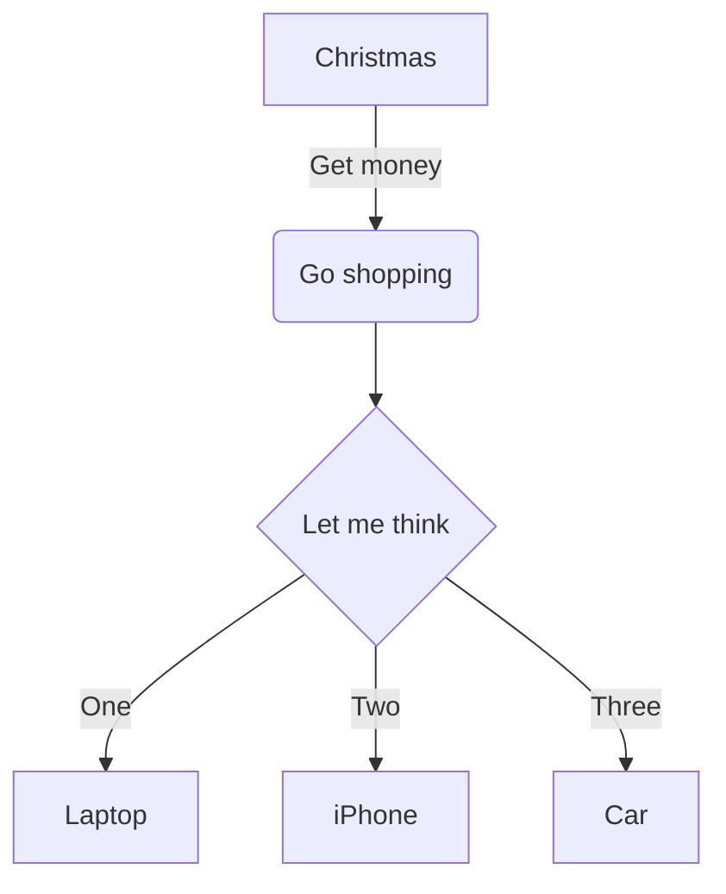
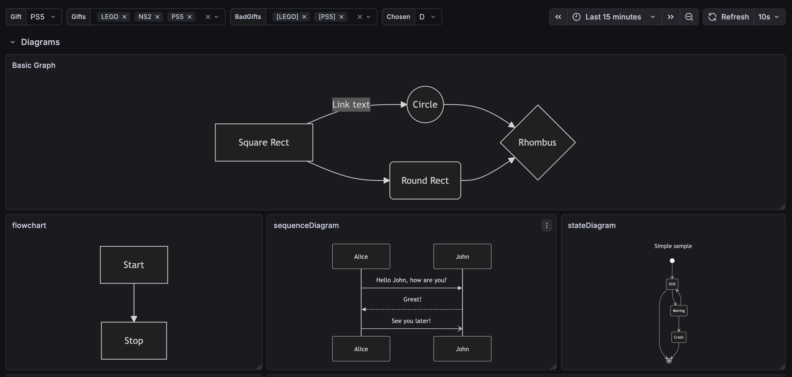
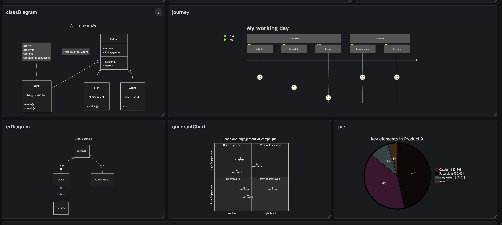
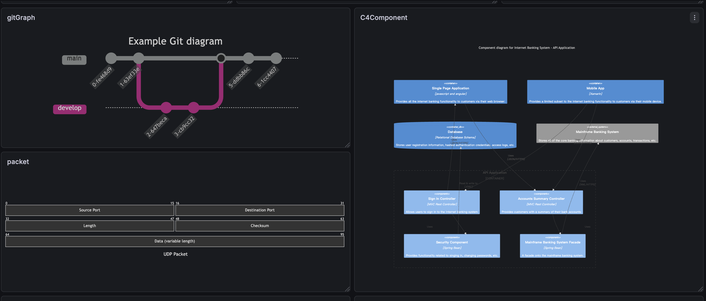
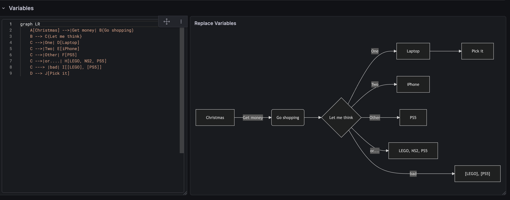
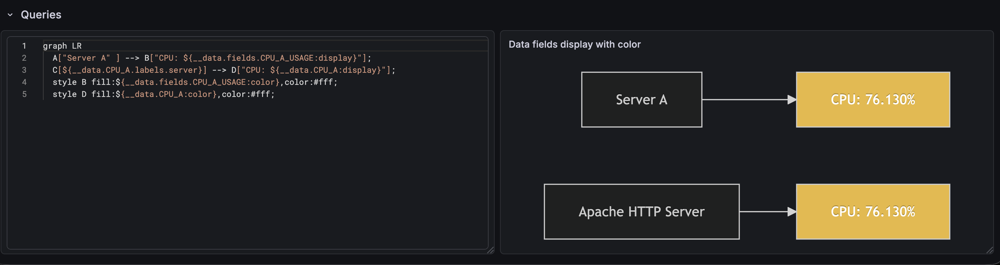

# Grafmaid — Mermaid.js Diagram Panel for Grafana

> [English](README.md)

## 概述

Grafmaid 是一個 Grafana Panel 外掛程式，將 [Mermaid.js](https://github.com/mermaid-js/mermaid) 圖表引擎整合進 Grafana Dashboard，讓使用者可以直接在面板中撰寫 Mermaid 語法來繪製各式圖表，並透過 Grafana 的 Dashboard Variables 動態控制圖表內容。

### 核心設計理念

1. **以文字驅動視覺化** — 使用者用純文字的 Mermaid 語法描述圖表，不需要拖拉式編輯器
2. **與 Grafana 生態系深度整合** — 支援 Dashboard Variables、Data Queries、Field Config (Units / Thresholds / Value Mappings)、主題切換、響應式縮放
3. **安全優先** — `securityLevel: 'strict'` 防止 XSS，特殊字元自動跳脫

---

## 架構

```
src/
├── components/
│   └── GrafmaidPanel.tsx          # 面板主元件，負責生命週期與渲染
├── utils/
│   ├── dataFrameExpander.ts       # Data Frame 查詢結果展開 (data blocks / 單值 / labels)
│   └── mermaidVariables.ts        # Dashboard Variables 處理工具函式
├── module.ts                      # 外掛程式進入點，面板選項與 Field Config 定義
├── types.ts                       # TypeScript 型別定義
└── plugin.json                    # 外掛程式中繼資料
tests/
├── unit/
│   ├── components/
│   │   └── GrafmaidPanel.test.tsx # 元件 Unit Test
│   └── utils/
│       ├── dataFrameExpander.test.ts  # Data Frame 展開 Unit Test
│       └── mermaidVariables.test.ts   # 變數處理 Unit Test
└── panel.spec.ts                  # E2E Test (Playwright + @grafana/plugin-e2e)
```

### 渲染流程

```
使用者輸入 Mermaid Content
        │
        ▼
┌─ expandDataBlocks() ──┐
│  展開 Data Frame 引用  │  ← 查詢結果 (data.series)
│  {{#each data}} 迭代   │  ← 多列展開
│  ${__data.*} 單值/label │  ← 直接引用
└────────────────────────┘
        │
        ▼
┌─ expandEachBlocks() ──┐
│  展開 {{#each}} 區塊   │  ← 多選 Dashboard Variables 展開
└────────────────────────┘
        │
        ▼
┌─ replaceVariables() ──┐
│  置換 $var / ${var}    │  ← Grafana Dashboard Variables
│  + mermaidSafeFormat   │  ← 選用：特殊字元跳脫
└────────────────────────┘
        │
        ▼
┌─ detectUnresolvedVariables() ─┐
│  偵測未定義的變數引用          │  → Alert severity="warning"
└───────────────────────────────┘
        │
        ▼
┌─ mermaid.parse() ─────┐
│  語法預驗證             │  → 失敗時提供精確錯誤訊息
└────────────────────────┘
        │
        ▼
┌─ mermaid.render() ────┐
│  渲染 SVG 圖表         │  → 嵌入面板 + 響應式縮放
└────────────────────────┘
```

---

## 功能詳解

### 1. 基本圖表渲染

在面板選項的 **Mermaid Content** 中輸入任何 Mermaid 語法即可渲染：



**支援的圖表類型**（涵蓋 Mermaid.js 全部類型）：

| 類型 | 語法關鍵字 | 說明 |
|------|-----------|------|
| Flowchart | `graph`, `flowchart` | 流程圖 |
| Sequence Diagram | `sequenceDiagram` | 循序圖 |
| Class Diagram | `classDiagram` | 類別圖 |
| State Diagram | `stateDiagram-v2` | 狀態圖 |
| ER Diagram | `erDiagram` | 實體關係圖 |
| Gantt Chart | `gantt` | 甘特圖 |
| Pie Chart | `pie` | 圓餅圖 |
| Mindmap | `mindmap` | 心智圖 |
| Timeline | `timeline` | 時間軸 |
| Git Graph | `gitGraph` | Git 分支圖 |
| C4 Diagram | `C4Component` | C4 架構圖 |
| Quadrant Chart | `quadrantChart` | 象限圖 |
| Kanban | `kanban` | 看板 |
| Architecture | `architecture-beta` | 架構圖 |
| Packet | `packet` | 封包圖 |
| Radar | `radar-beta` | 雷達圖 |

#### 截圖







### 2. Dashboard Variables 置換

支援 Grafana 的 [Dashboard Variables](https://grafana.com/docs/grafana/latest/dashboards/variables/)，在 Mermaid Content 中使用 `$varName` 或 `${varName}` 語法引用變數。

#### 單選變數

```
# Dashboard Variable: env = "Production"

graph TD
    A[Service] --> B[$env]
```

渲染結果中 `$env` 會被置換為 `Production`。

#### 格式指定

可搭配 Grafana 的 [Variable format](https://grafana.com/docs/grafana/latest/dashboards/variables/variable-syntax/#advanced-variable-format-options) 語法：

- `${var:text}` — 文字格式
- `${var:csv}` — 逗號分隔
- `${var:pipe}` — Pipe 分隔

#### 截圖



### 3. 多選變數展開 (`{{#each}}`)

當 Dashboard Variable 設定為 **Multi-value** 時，單純的 `$var` 置換會產生 `A, B, C` 這樣的合併字串，無法直接用於 Mermaid 的節點或連線定義。

**解決方案**：使用 `{{#each varName}}...{{/each}}` 模板語法，將多選變數的每個值展開為獨立的 Mermaid 定義。

#### 語法

```
{{#each varName}}
    ... {{value}} ... {{index}} ...
{{/each}}
```

| 佔位符 | 說明 |
|--------|------|
| `{{value}}` | 當前迭代的變數值 |
| `{{index}}` | 當前迭代的索引 (從 0 開始) |

#### 範例：動態拓撲圖

假設 Dashboard Variable `targets` 為 Multi-value，選取了 `DB`、`Cache`、`Queue`：

**輸入**：

```
graph TD
    Service[Web Service]
{{#each targets}}
    target_{{index}}[{{value}}]
    Service --> target_{{index}}
{{/each}}
```

**展開後**：

```
graph TD
    Service[Web Service]
    target_0[DB]
    Service --> target_0
    target_1[Cache]
    Service --> target_1
    target_2[Queue]
    Service --> target_2
```

#### 範例：混合使用一般變數與 `{{#each}}`

```
graph TD
    $source[Source: $env]
{{#each destinations}}
    dest_{{index}}[{{value}}]
    $source --> dest_{{index}}
{{/each}}
```

此範例中 `$source`、`$env` 為一般單選變數，`destinations` 為多選變數。`{{#each}}` 區塊先展開後，再由 `replaceVariables` 統一置換 `$source`、`$env`。

### 4. Data Queries 整合

面板支援 Grafana 的 Data Source 查詢，讓 Mermaid 圖表能根據即時資料動態更新。啟用 `useFieldConfig()` 後，Standard Options (Units、Thresholds、Value Mappings、Color scheme 等) 皆可在面板 editor 中設定。

#### Standard Options 預設值

| 選項 | 預設值 |
|------|--------|
| Color scheme | From thresholds (by value) |
| Thresholds | Base: green, 80: red |

#### 語法總覽

##### 簡寫語法（自動取第一個非 Time 值欄位）

```
${__data.CPU_A}              — 原始值（依 refId 指定 series）
${__data.CPU_A:display}      — 格式化值（套用 unit、decimals、value mapping）
${__data.CPU_A:color}        — 顏色（由 Color scheme 控制，預設依 thresholds）
```

##### 完整語法（指定欄位名稱）

```
${__data.fields.Value}                   — series[0] 的 Value 欄位
${__data.CPU_A.fields.Value:display}     — 指定 series + 欄位 + 格式化
${__data.fields["Field Name"]:display}   — bracket notation（欄位名含空格）
${__data.fields[0]}                      — 依欄位索引
```

##### Label 存取

```
${__data.CPU_A.labels.http_status}   — 取值欄位的 label
${__data.labels.server}              — series[0] 的 label
```

##### 迭代模式（多列展開）

```
{{#each data}}             — 迭代 series[0] 的每一列
{{#each data.1}}           — 迭代 series[1]
{{#each data.CPU_A}}       — 依 refId 或 series name 指定
```

迭代區塊內可使用 `${__index}` (列索引) 和 `${__rowCount}` (總列數)。

#### Series 解析優先順序

`${__data.CPU_A.fields.Value}` 中的 `CPU_A` 依以下順序匹配：

1. **refId** — query 的 reference ID（如 A、B 或自訂名稱 CPU_A）
2. **series name** — DataFrame 的 name 屬性
3. 未匹配時保留原樣

#### 範例：單值模式

查詢 `CPU_A` 回傳 CPU 使用率，搭配 Thresholds (0: green, 80: red)：

```
graph LR
    A["${__data.CPU_A.labels.server}"] --> B["CPU: ${__data.CPU_A:display}"]
    style B fill:${__data.CPU_A:color},color:#fff
```

展開結果（假設最後一列 CPU = 92%，label server = "Apache HTTP Server"）：

```
graph LR
    A["Apache HTTP Server"] --> B["CPU: 92%"]
    style B fill:#F2495C,color:#fff
```

#### 範例：迭代模式

查詢回傳多列服務資料：

```
graph TD
    {{#each data}}
    node_${__index}["${__data.fields.Name}: ${__data.fields.Value:display}"]
    style node_${__index} fill:${__data.fields.Value:color}
    {{/each}}
```

#### 範例：混合 Data Queries 與 Dashboard Variables

```
graph TD
    title["Environment: $env"]
    {{#each data.CPU_A}}
    svc_${__index}["${__data.fields.Name}"]
    title --> svc_${__index}
    {{/each}}
```

#### 截圖



### 5. 特殊字元跳脫

**面板選項**：Escape special characters（預設開啟）

當變數值包含 Mermaid 語法的特殊字元（如 `[ ] { } ( ) | > <`），這些字元會破壞圖表結構。

#### 問題

```
# $service = "Web [v2.0]"
graph TD
    A[$service] --> B
# 置換後：A[Web [v2.0]] → 中括號巢狀，語法錯誤
```

#### 解決方案

開啟 **Escape special characters** 後，變數值中的特殊字元會自動轉換為 Mermaid 的 `#code;` 字元實體：

```
# 置換後：A[Web #91;v2.0#93;] → 正確渲染為 "Web [v2.0]"
```

#### 跳脫對照表

| 原始字元 | 跳脫後 | 說明 |
|----------|--------|------|
| `#` | `#35;` | Hash (優先處理避免雙重跳脫) |
| `[` | `#91;` | 左中括號 |
| `]` | `#93;` | 右中括號 |
| `{` | `#123;` | 左大括號 |
| `}` | `#125;` | 右大括號 |
| `(` | `#40;` | 左小括號 |
| `)` | `#41;` | 右小括號 |
| `\|` | `#124;` | Pipe |
| `>` | `#62;` | 大於 |
| `<` | `#60;` | 小於 |
| `"` | `#34;` | 雙引號 |

> **注意**：如果你的變數值本身就包含有意義的 Mermaid 語法（例如變數值就是一段連線定義 `-->`），請關閉此選項。

### 6. 未定義變數偵測

面板會自動掃描 Mermaid Content 中的 `$varName` / `${varName}` 引用，並透過 Grafana 的 `replaceVariables` API 逐一確認變數是否存在。

- **未定義的變數**：以 `Alert severity="warning"` 在面板頂部顯示警告
- **Mermaid 內建 `$` 變數**：自動排除，不會誤報（如 C4 diagram 的 `$offsetX`、`$offsetY`）

#### 已排除的 Mermaid 內建變數

`$offsetX`, `$offsetY`, `$color`, `$textColor`, `$lineColor`, `$stroke`, `$fill`, `$bgColor`, `$TICKET`, `$style`, `$classDef`

### 7. 語法預驗證

渲染前先呼叫 `mermaid.parse()` 驗證語法。相較於直接呼叫 `mermaid.render()` 出錯，`parse()` 能提供更精確且乾淨的錯誤訊息，不會留下殘餘的 DOM 元素。

### 8. 錯誤呈現

遵循 Grafana 官方 best practices，使用 `@grafana/ui` 的 `Alert` 元件呈現錯誤：

- **`severity="warning"`** — 未定義變數警告
- **`severity="error"`** — Mermaid 語法或渲染錯誤
  - 顯示錯誤訊息
  - 可展開的 `<details>` 區塊顯示置換後的完整內容，方便除錯
- **`console.error`** — 技術細節記錄到瀏覽器 console

### 9. 響應式縮放與主題切換

- **響應式**：渲染後的 SVG 設為 `maxWidth: 100%` / `maxHeight: 100%`，隨面板大小自動縮放
- **主題**：根據 Grafana 的 `theme.isDark` 自動切換 Mermaid 主題 (`dark` / `default`)

---

## 面板選項

| 選項 | 型別 | 預設值 | 說明 |
|------|------|--------|------|
| Mermaid Content | `string` (textarea) | 範例 flowchart | Mermaid 圖表定義語法 |
| Escape special characters | `boolean` | `true` | 是否自動跳脫變數值中的特殊字元 |

---

## 測試策略

### Unit Test (Jest + React Testing Library)

```bash
npm test          # Watch mode
npm run test:ci   # CI mode
```

| 測試檔案 | 測試數 | 涵蓋範圍 |
|----------|--------|----------|
| `tests/unit/utils/mermaidVariables.test.ts` | 22 | `escapeMermaidChars`, `mermaidSafeFormat`, `expandEachBlocks`, `detectUnresolvedVariables` |
| `tests/unit/utils/dataFrameExpander.test.ts` | 49 | `expandDataBlocks`: 欄位替換、display/color 修飾符、series selector (index/refId/name)、label 存取、簡寫語法、null 處理、escape |
| `tests/unit/components/GrafmaidPanel.test.tsx` | 15 | 元件渲染、變數置換整合、錯誤處理、警告顯示、`{{#each}}` 展開、data.series 整合 |

### E2E Test (Playwright + @grafana/plugin-e2e)

```bash
npm run server    # Terminal 1: 啟動 Grafana Docker
npm run e2e       # Terminal 2: 執行 E2E 測試
```

| 測試檔案 | 測試數 | 涵蓋範圍 |
|----------|--------|----------|
| `tests/panel.spec.ts` | 4 | SVG 渲染、錯誤顯示、選項變更、變數置換 |

---

## 未來擴充方向

### 短期 (Near-term)

#### 自訂 Mermaid Theme

目前只支援 `dark` / `default` 兩種主題。可以新增面板選項讓使用者自訂 Mermaid 的 `themeVariables`（節點顏色、邊框樣式、字體大小等），更好地融入不同 Dashboard 的視覺風格。

#### CodeEditor 取代 Textarea

目前 Mermaid Content 使用基本的 textarea。可以整合 Grafana 的 `CodeEditor` 元件（基於 Monaco Editor），提供：
- Mermaid 語法高亮
- 自動補全
- 即時語法錯誤標示
- 行號顯示

### 中期 (Mid-term)

#### 節點互動與 Data Links

讓使用者為 Mermaid 圖表中的節點設定 [Data Links](https://grafana.com/docs/grafana/latest/panels-visualizations/configure-data-links/)，點擊節點時跳轉到其他 Dashboard 或外部 URL：

```
# 構想：在面板選項中定義 node-to-link mapping
# A → https://grafana.local/d/service-detail?var-service=A
```

實作方向：
- `securityLevel` 需調整為 `'loose'` 以支援節點的 click event
- 新增 mapping 設定，將節點 ID 對應到 URL 模板
- 支援 Grafana 的 `${__data.fields.*}` 語法

#### 多圖表分頁

支援在單一面板中定義多個 Mermaid 圖表，以 Tab 分頁呈現：

```
---tab: Overview---
graph TD
    A --> B --> C
---tab: Detail---
sequenceDiagram
    A->>B: Request
    B-->>A: Response
```

#### 匯出功能

提供將圖表匯出為 PNG / SVG / PDF 的按鈕，方便在文件或簡報中使用。

### 長期 (Long-term)

#### 即時協作編輯

搭配 Grafana 的 Live 功能，讓多個使用者可以同時編輯同一張 Mermaid 圖表，即時看到彼此的變更。

#### Annotation 整合

將 Grafana Annotations 事件標記在 Mermaid 圖表上。例如在 Gantt chart 上標記部署事件，或在 Sequence Diagram 上標記異常時間點。

#### AI 輔助生成

整合 LLM 讓使用者用自然語言描述圖表，自動產生 Mermaid 語法：

```
# 使用者輸入：「畫一個微服務架構圖，包含 API Gateway、User Service、Order Service 和 PostgreSQL」
# 自動產生對應的 Mermaid flowchart
```
